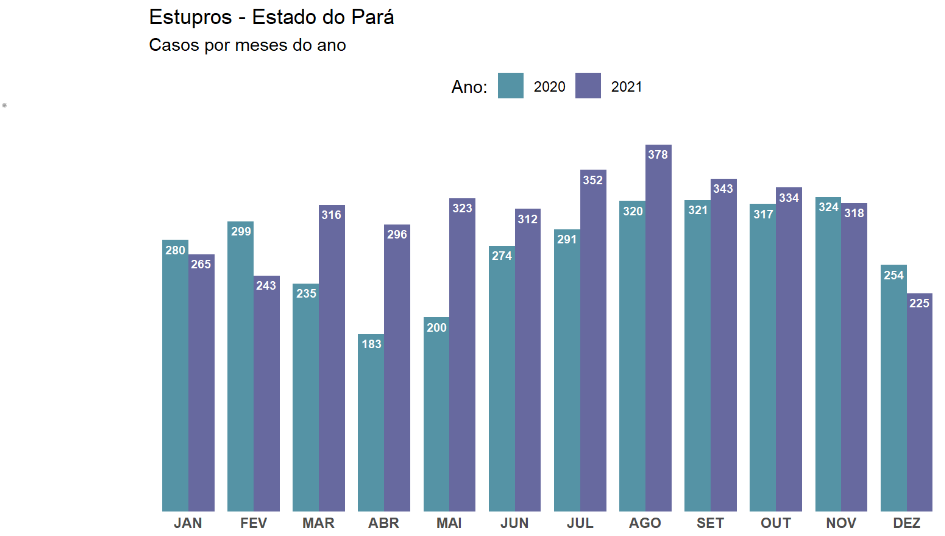
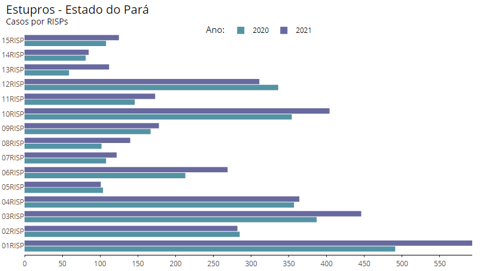
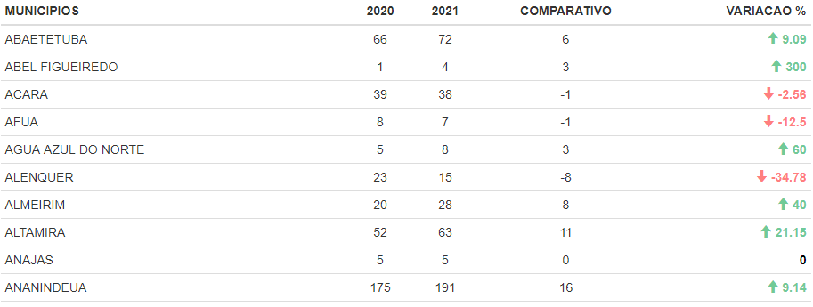

# Análise Exploratória de Dados sobre casos de estupros no estado do Pará durante o período da pandemia

## Introdução

A pandemia da covid-19 iniciada no ano de 2020 impactou na vida de todos ao redor do planeta em questões relacionadas a conviência, trabalho, saúde e até nos comportamentos das pessoas. Em relação aos comportamentos, tivemos que ficar confinados em nossas residências como uma forma de proteção ao contágio pelo vírus da covid-19. Porém, seria interessante analisar o comportamento de casos de estupros para ver se eles foram influenciados por este contexto de isolamento no estado do Pará. 

A resposta para qualquer tipo de questionamento deve ser com base em dados. Para este trabalho, vamos usar os dados presentes na página do Portal da Transparência da Secretaria de Segurança Pública e Defesa Social do Pará - SEGUP/PA (<http://sistemas.segup.pa.gov.br/transparencia/>). Nela, é possível obter dados sobre questôes relacionadas ao número de casos de homicídios, latrocínios, estupros etc registrados em todos os municípios do estado.

## Objetivo

Este trabalho teve como objetivo realizar uma análise exploratória em dados sobre casos de estupros registrados no ano de 2020 e 2021. O período escolhido tem como base analisar o comportamento dos casos durante a fase inicial da pandemia do novo coronavirus e comparar com dados do ano posterior. 

## Metodologia

Os dados utilizados foram coletados da página do portal da transparência da SEGUP-PA usando técnica de Webscraping sendo salvos em arquivos no formato .csv e compartilhados para facilitar futuras análises. Os processo de coleta, tratamento, manipulação e exibição dos dados foram feito por meio da linguagem de programação R. Também foi gerado um relatório através da biblioteca RMarkdown para proporcionar uma melhor experiência por meio da visualização em qualquer navegador Web. Os resultados foram apresentados em formatos de gráficos estáticos e interativos bem como por meio de tabelas interativas. 

## Resultados

Aqui temos uma sintese dos resultados gerados por meio da análise dos dados. Para maior experiência, acessar o arquivo **ad_dados_segup_estupros.html**.

1. Gráfico: Casos de estupros contabilizados para os meses dos anos de 2020 e 2021

 
 

2. Gráfico: Casos de estupros contabilizados por RISPs nos anos de 2020 e 2021

3. Tabela: Casos de estupros contabilizados para cada município do estado nos anos de 2020 e 2021

## Conclusão

Este trabalho meramente descritivo e com objetivos acadêmicos teve como objetivo realizar um estudo simples sobre o comportamento dos casos de estupros no ano de 2020, ano este em que tivemos uma mudança de comportamento mundial devido a pandemia do novo corona vírus. Também fizemos uma comparação com os casos no ano posterior (2021). Os resultados deixaram claros que houve uma queda significativa nos primeiros meses de 2020 assim que foi declarado o isolamento social. Entretanto, os casos voltaram a aumentar entre os meses de junho a dezembro. Em relação ao ano de 2021, ficou claro que os casos aumentaram significativamente ao longo de todo o ano muito pelo fato dos relaxamentos das medidas de restrição social. É importante destacar que o mesmo não foi validado por um especialista, portanto os argumentos presentes podem ser superficiais, contudo as realizações são pertinentes. Trabalhos futuros podem realizar comparações com dados do ano de 2019 para informar o comportamento antes, durante e após o ano de início da pandemia. Os dados compartilhados também permitem realizar diversas outras análises e gráficos.
