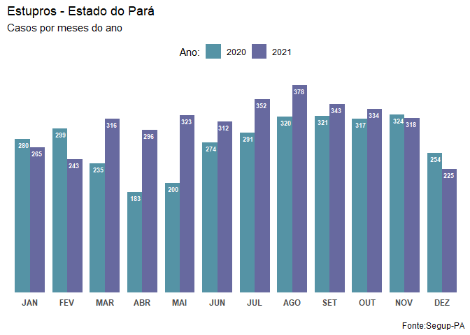
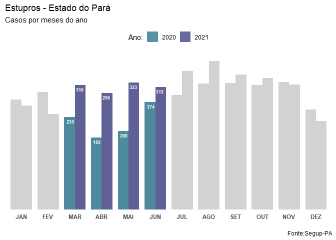

## **Apresentação**

A pandemia da covid-19 iniciada no ano de 2020 impactou na vida de todos ao redor do planeta em questões relacionadas a conviência, trabalho, saúde e até nos comportamentos das pessoas. Em relação aos comportamentos, tivemos que ficar confinados em nossas residências como uma forma de proteção ao contágio pelo vírus da covid-19. Porém, seria interessante analisar o comportamento de casos de estupros para ver se eles foram influenciados por este contexto de isolamento no estado do Pará. 

A resposta para qualquer tipo de questionamento deve ser com base em dados. Para este trabalho, vamos usar os dados presentes na página do Portal da Transparência da Secretaria de Segurança Pública e Defesa Social do Pará - SEGUP/PA (<http://sistemas.segup.pa.gov.br/transparencia/>). Nela, é possível obtermos estatísticas sobre questôes relacionadas a homicídios, latrocínios, estupros etc para todos os municípios do estado. 

## **A base**

O portal fornece dados coletados entre todos os mêses dos anos 2010 até 2021 (considerando que estamos em 2022). Eles são estruturados em:

- **Município**
    - 144 municípios. 
- **RISP**
    - Regiões Integradas de Segurança Pública. 
    - Em um total de 15 RISPs.
    - Forma de organização e distribuição operacionaldos órgãos do Sistema Estadual de Segurança Pública e Defesa Social.
- **Mêses do ano**
    - Cada mês do ano é uma coluna na tabela

Os valores numéricos correspondem a quantidade total de casos por mês para cada município do estado.

### **Os dados**

Os dados foram extraídos da página usando técnica de Webscraping por meio da biblioteca [rverst](https://rvest.tidyverse.org/). Após isso, foram salvos em dois arquivos em formato csv para que os dados possam ser usados sem ter que extraí-los novamente da página. Neste caso, vamos usar dados de 2020 e 2021. 

Nome dos arquivos:

- ocorrencia de estupros - pa 2020.csv
- ocorrencia de estupros - pa 2021.csv

### **Acessando os dados**

Vamos carregar os dados fazendo a leitura dos arquivos .csv


```r
dados_2020 <- read.csv("Data/ocorrencia de estupros - pa 2020.csv")
dados_2021 <- read.csv("Data/ocorrencia de estupros - pa 2021.csv")
```

<br></br>

**Ocorrências de estupros no ano de 2020:**

<br></br>


```{=html}
<div id="htmlwidget-7801653b527948860a82" style="width:100%;height:auto;" class="datatables html-widget"></div>
<script type="application/json" data-for="htmlwidget-7801653b527948860a82">{"x":{"filter":"none","vertical":false,"data":[["1","2","3","4","5","6","7","8","9","10","11","12","13","14","15","16","17","18","19","20","21","22","23","24","25","26","27","28","29","30","31","32","33","34","35","36","37","38","39","40","41","42","43","44","45","46","47","48","49","50","51","52","53","54","55","56","57","58","59","60","61","62","63","64","65","66","67","68","69","70","71","72","73","74","75","76","77","78","79","80","81","82","83","84","85","86","87","88","89","90","91","92","93","94","95","96","97","98","99","100","101","102","103","104","105","106","107","108","109","110","111","112","113","114","115","116","117","118","119","120","121","122","123","124","125","126","127","128","129","130","131","132","133","134","135","136","137","138","139","140","141","142","143","144"],[1,2,3,4,5,6,7,8,9,10,11,12,13,14,15,16,17,18,19,20,21,22,23,24,25,26,27,28,29,30,31,32,33,34,35,36,37,38,39,40,41,42,43,44,45,46,47,48,49,50,51,52,53,54,55,56,57,58,59,60,61,62,63,64,65,66,67,68,69,70,71,72,73,74,75,76,77,78,79,80,81,82,83,84,85,86,87,88,89,90,91,92,93,94,95,96,97,98,99,100,101,102,103,104,105,106,107,108,109,110,111,112,113,114,115,116,117,118,119,120,121,122,123,124,125,126,127,128,129,130,131,132,133,134,135,136,137,138,139,140,141,142,143,144],["ABAETETUBA","ABEL FIGUEIREDO","ACARA","AFUA","AGUA AZUL DO NORTE","ALENQUER","ALMEIRIM","ALTAMIRA","ANAJAS","ANANINDEUA","ANAPU","AUGUSTO CORREA","AURORA DO PARA","AVEIRO","BAGRE","BAIAO","BANNACH","BARCARENA","BELEM","BELTERRA","BENEVIDES","BOM JESUS DO TOCANTINS","BONITO","BRAGANCA","BRASIL NOVO","BREJO GRANDE DO ARAGUAIA","BREU BRANCO","BREVES","BUJARU","CACHOEIRA DO ARARI","CACHOEIRA DO PIRIA","CAMETA","CANAA DOS CARAJAS","CAPANEMA","CAPITAO POCO","CASTANHAL","CHAVES","COLARES","CONCEICAO DO ARAGUAIA","CONCORDIA DO PARA","CUMARU DO NORTE","CURIONOPOLIS","CURRALINHO","CURUA","CURUCA","DOM ELISEU","ELDORADO DOS CARAJAS","FARO","FLORESTA DO ARAGUAIA","GARRAFAO DO NORTE","GOIANESIA DO PARA","GURUPA","IGARAPE ACU","IGARAPE MIRI","INHANGAPI","IPIXUNA DO PARA","IRITUIA","ITAITUBA","ITUPIRANGA","JACAREACANGA","JACUNDA","JURUTI","LIMOEIRO DO AJURU","MAE DO RIO","MAGALHAES BARATA","MARABA","MARACANA","MARAPANIM","MARITUBA","MEDICILANDIA","MELGACO","MOCAJUBA","MOJU","MOJUI DOS CAMPOS","MONTE ALEGRE","MUANA","NOVA ESPERANCA DO PIRIA","NOVA IPIXUNA","NOVA TIMBOTEUA","NOVO PROGRESSO","NOVO REPARTIMENTO","OBIDOS","OEIRAS DO PARA","ORIXIMINA","OUREM","OURILANDIA DO NORTE","PACAJA","PALESTINA DO PARA","PARAGOMINAS","PARAUAPEBAS","PAU D'ARCO","PEIXE BOI","PICARRA","PLACAS","PONTA DE PEDRAS","PORTEL","PORTO DE MOZ","PRAINHA","PRIMAVERA","QUATIPURU","REDENCAO","RIO MARIA","RONDON DO PARA","RUROPOLIS","SALINOPOLIS","SALVATERRA","SANTA BARBARA DO PARA","SANTA CRUZ DO ARARI","SANTA IZABEL DO PARA","SANTA LUZIA DO PARA","SANTA MARIA DAS BARREIRAS","SANTA MARIA DO PARA","SANTANA DO ARAGUAIA","SANTAREM","SANTAREM NOVO","SANTO ANTONIO DO TAUA","SAO CAETANO DE ODIVELAS","SAO DOMINGOS DO ARAGUAIA","SAO DOMINGOS DO CAPIM","SAO FELIX DO XINGU","SAO FRANCISCO DO PARA","SAO GERALDO DO ARAGUAIA","SAO JOAO DA PONTA","SAO JOAO DE PIRABAS","SAO JOAO DO ARAGUAIA","SAO MIGUEL DO GUAMA","SAO SEBASTIAO DA BOA VISTA","SAPUCAIA","SENADOR JOSE PORFIRIO","SOURE","TAILANDIA","TERRA ALTA","TERRA SANTA","TOME ACU","TRACUATEUA","TRAIRAO","TUCUMA","TUCURUI","ULIANOPOLIS","URUARA","VIGIA","VISEU","VITORIA DO XINGU","XINGUARA"],["04RISP","10RISP","04RISP","08RISP","14RISP","12RISP","12RISP","11RISP","08RISP","02RISP","11RISP","06RISP","07RISP","15RISP","08RISP","04RISP","14RISP","04RISP","01RISP","12RISP","02RISP","10RISP","06RISP","06RISP","11RISP","10RISP","09RISP","08RISP","03RISP","05RISP","06RISP","04RISP","10RISP","06RISP","06RISP","03RISP","08RISP","03RISP","13RISP","03RISP","13RISP","10RISP","08RISP","12RISP","03RISP","07RISP","10RISP","12RISP","13RISP","06RISP","09RISP","08RISP","03RISP","04RISP","03RISP","07RISP","03RISP","15RISP","10RISP","15RISP","09RISP","12RISP","04RISP","07RISP","03RISP","10RISP","03RISP","03RISP","02RISP","11RISP","08RISP","04RISP","04RISP","12RISP","12RISP","05RISP","06RISP","10RISP","06RISP","15RISP","09RISP","12RISP","04RISP","12RISP","06RISP","14RISP","09RISP","10RISP","07RISP","10RISP","13RISP","06RISP","10RISP","15RISP","05RISP","08RISP","11RISP","12RISP","06RISP","06RISP","13RISP","14RISP","10RISP","15RISP","06RISP","05RISP","02RISP","05RISP","03RISP","06RISP","13RISP","03RISP","13RISP","12RISP","06RISP","03RISP","03RISP","10RISP","03RISP","14RISP","03RISP","10RISP","03RISP","06RISP","10RISP","03RISP","08RISP","14RISP","11RISP","05RISP","09RISP","03RISP","12RISP","03RISP","06RISP","15RISP","14RISP","09RISP","07RISP","11RISP","03RISP","06RISP","11RISP","14RISP"],[3,0,1,0,0,2,3,6,0,17,1,3,3,0,0,0,0,9,48,0,4,1,1,3,1,2,3,4,0,2,2,2,3,0,0,4,0,0,1,2,0,5,1,0,3,1,0,0,0,2,1,0,0,2,0,2,1,6,4,0,2,2,1,0,0,3,3,2,6,2,0,0,4,1,2,0,1,0,0,0,2,2,0,3,1,1,0,0,4,12,0,0,1,1,2,1,0,0,0,0,5,0,0,1,2,0,1,1,3,0,0,0,3,11,1,1,0,1,0,4,0,1,0,0,2,3,2,0,0,3,4,0,0,0,0,1,1,3,2,1,1,1,0,3],[5,0,4,0,2,3,1,7,0,14,0,2,2,1,1,1,0,13,43,0,9,0,0,7,1,3,0,4,2,1,0,4,1,2,2,2,1,3,1,1,1,3,1,0,2,2,1,0,0,0,7,1,1,2,0,4,4,1,0,0,4,2,2,0,1,5,1,3,7,0,0,4,7,0,0,0,0,0,0,0,0,2,0,11,0,1,0,0,3,15,0,0,0,0,1,1,0,1,0,0,0,3,0,3,1,1,0,0,3,1,0,0,0,6,1,0,1,0,0,5,1,2,0,4,0,1,1,0,1,5,1,0,1,8,1,0,0,0,0,2,1,1,0,0],[5,0,7,0,0,3,2,5,0,13,0,1,1,1,1,1,0,5,32,1,2,0,0,3,1,1,2,2,1,4,0,1,7,2,0,5,0,0,2,0,0,1,2,0,4,0,0,0,0,0,0,0,0,0,0,4,0,5,0,0,1,3,0,2,0,6,2,0,6,0,1,1,4,2,4,0,0,0,0,2,2,3,1,0,0,2,2,2,4,13,0,0,1,1,1,2,1,0,0,0,2,0,0,0,0,2,1,0,1,0,0,0,1,9,1,1,1,1,1,0,0,1,0,0,1,2,2,0,1,2,1,0,0,1,0,0,1,2,0,1,2,0,1,0],[1,0,2,1,0,1,1,2,0,6,1,0,0,1,1,0,0,2,16,1,0,4,0,2,2,1,0,0,1,1,0,1,3,2,0,4,1,2,1,0,0,0,1,0,1,0,2,0,0,0,0,1,0,2,0,0,1,0,3,0,1,1,0,1,0,4,0,0,2,3,1,0,5,1,2,1,1,0,0,0,3,2,1,2,0,0,1,0,0,4,1,0,3,1,0,0,2,0,0,0,2,0,4,0,2,5,0,0,3,2,0,3,2,14,1,0,0,1,2,0,2,1,1,1,3,3,0,0,1,4,1,0,0,2,0,0,0,4,1,2,0,1,0,0],[5,0,0,0,0,3,1,5,0,15,0,0,4,0,0,0,0,1,34,0,2,0,0,3,2,0,2,0,2,0,0,3,0,1,3,6,0,0,0,1,0,4,1,0,1,1,1,0,1,0,0,0,2,2,0,4,0,1,3,0,1,3,0,0,0,11,0,1,3,0,1,0,2,0,2,0,0,1,0,0,1,2,0,3,0,0,1,0,3,3,0,0,0,1,0,0,1,0,0,0,2,0,1,2,3,4,0,0,4,1,0,0,2,8,1,0,1,1,0,1,1,0,0,1,1,2,0,0,1,0,1,0,0,0,1,0,0,1,0,1,1,2,1,1],[3,0,2,1,0,1,2,5,0,10,2,2,0,0,0,0,0,6,35,0,4,1,0,2,0,0,3,0,0,3,1,1,1,2,1,8,0,0,2,0,0,1,0,0,1,2,2,0,0,1,2,0,3,5,1,1,1,6,4,0,3,3,0,1,2,6,3,3,5,2,0,1,10,0,1,2,0,0,1,1,1,4,0,3,0,1,1,0,1,10,1,0,0,0,3,1,0,0,0,0,1,2,2,0,3,1,0,0,4,1,0,1,2,12,0,4,1,1,5,4,0,0,0,0,0,2,1,0,1,3,4,0,0,6,0,1,0,3,0,4,3,1,1,2],[4,1,1,0,1,3,3,6,1,9,4,0,2,1,1,1,0,11,38,1,4,0,0,2,0,1,4,2,0,2,1,4,0,2,4,5,0,1,0,6,0,4,2,0,1,2,2,0,0,1,4,2,0,6,1,3,1,7,3,1,1,4,0,2,0,2,1,0,5,0,0,2,8,1,3,2,0,0,0,0,2,4,3,2,0,0,2,2,2,15,0,0,0,1,0,1,1,0,0,1,1,2,1,0,1,0,1,3,2,0,0,0,0,11,0,3,1,2,0,4,1,2,0,0,1,0,0,0,0,2,3,1,0,5,0,0,0,3,0,1,1,3,0,3],[9,0,8,3,0,1,1,2,1,22,0,0,0,0,0,1,0,6,47,1,8,0,0,3,0,0,2,3,2,1,1,4,3,0,1,8,2,0,2,4,0,1,0,1,3,0,1,0,1,0,1,0,3,3,1,2,1,9,5,1,0,4,1,1,1,3,0,1,5,1,2,0,11,0,2,2,0,0,1,2,2,1,2,4,0,4,2,0,3,11,0,1,0,0,0,0,4,1,0,2,2,1,2,4,4,1,1,1,1,0,0,0,1,11,0,2,2,1,0,5,0,1,0,0,2,2,0,0,1,3,1,1,1,3,2,1,0,3,1,2,3,1,0,0],[2,0,2,0,0,1,3,1,0,17,1,2,2,1,1,0,0,4,54,1,3,1,0,4,1,1,3,2,2,2,3,3,2,4,2,6,0,2,1,0,0,1,1,1,4,0,1,0,0,0,6,0,4,2,0,4,2,3,1,0,2,4,0,1,1,8,1,1,1,0,0,1,7,1,5,0,2,0,0,3,4,4,1,4,3,4,0,0,3,11,0,1,1,3,1,2,2,1,2,0,1,1,0,5,1,1,2,1,2,0,1,1,0,15,1,0,4,2,1,3,0,1,1,0,0,1,1,0,2,5,2,0,1,4,0,1,1,3,0,1,2,2,0,2],[9,0,4,0,0,3,1,3,2,21,0,1,1,0,1,0,0,9,48,5,6,4,1,4,1,1,0,0,0,1,0,6,4,1,3,6,0,1,0,1,0,2,3,0,2,1,0,0,1,0,2,1,2,4,0,2,5,8,1,0,0,2,0,1,0,3,3,1,4,2,0,1,3,0,1,2,0,0,0,1,2,3,2,1,0,2,3,2,3,8,1,0,0,0,6,3,0,0,2,1,2,0,0,1,1,1,2,0,2,0,1,1,2,23,0,2,1,0,1,2,0,0,0,3,1,1,0,0,0,0,4,2,0,1,4,0,0,5,0,4,1,2,2,0],[11,0,5,2,2,0,1,4,1,20,1,4,0,1,0,1,0,10,47,3,5,1,0,3,1,0,4,6,2,3,0,1,0,1,1,4,1,0,0,2,0,2,1,0,0,1,1,0,0,1,4,3,0,1,0,1,2,2,2,1,0,4,0,1,1,3,4,2,5,1,0,2,7,0,1,1,0,1,1,4,0,1,3,4,1,2,1,1,2,11,1,0,0,1,0,3,3,0,0,0,2,1,0,2,3,0,3,0,6,4,1,1,2,13,0,3,0,3,1,0,2,1,1,2,0,1,1,0,4,6,2,0,1,1,0,0,0,3,3,6,2,0,0,1],[9,0,3,1,0,2,1,6,0,11,4,2,4,0,0,0,0,5,49,2,1,0,0,5,1,1,0,3,0,1,1,4,3,4,0,7,3,0,2,1,0,0,0,0,1,0,0,0,0,1,5,0,2,1,1,0,3,2,1,0,0,0,1,1,0,7,1,3,1,0,1,0,4,0,0,0,2,0,1,0,2,1,0,1,1,2,0,0,6,7,0,0,0,3,1,0,0,3,0,0,1,1,1,1,2,1,1,0,1,1,0,3,0,5,0,3,1,0,0,1,1,0,0,0,0,2,0,0,1,2,4,1,0,2,0,1,1,5,0,1,5,2,0,1]],"container":"<table class=\"display\">\n  <thead>\n    <tr>\n      <th> <\/th>\n      <th>X<\/th>\n      <th>MUNICIPIO<\/th>\n      <th>RISP<\/th>\n      <th>JAN<\/th>\n      <th>FEV<\/th>\n      <th>MAR<\/th>\n      <th>ABR<\/th>\n      <th>MAI<\/th>\n      <th>JUN<\/th>\n      <th>JULHO<\/th>\n      <th>AGO<\/th>\n      <th>SET<\/th>\n      <th>OUT<\/th>\n      <th>NOV<\/th>\n      <th>DEZ<\/th>\n    <\/tr>\n  <\/thead>\n<\/table>","options":{"columnDefs":[{"className":"dt-right","targets":[1,4,5,6,7,8,9,10,11,12,13,14,15]},{"orderable":false,"targets":0}],"order":[],"autoWidth":false,"orderClasses":false}},"evals":[],"jsHooks":[]}</script>
```

<br></br>

**Ocorrências de estupros no ano de 2021:**

<br></br>


```{=html}
<div id="htmlwidget-1279689a64e16c29125a" style="width:100%;height:auto;" class="datatables html-widget"></div>
<script type="application/json" data-for="htmlwidget-1279689a64e16c29125a">{"x":{"filter":"none","vertical":false,"data":[["1","2","3","4","5","6","7","8","9","10","11","12","13","14","15","16","17","18","19","20","21","22","23","24","25","26","27","28","29","30","31","32","33","34","35","36","37","38","39","40","41","42","43","44","45","46","47","48","49","50","51","52","53","54","55","56","57","58","59","60","61","62","63","64","65","66","67","68","69","70","71","72","73","74","75","76","77","78","79","80","81","82","83","84","85","86","87","88","89","90","91","92","93","94","95","96","97","98","99","100","101","102","103","104","105","106","107","108","109","110","111","112","113","114","115","116","117","118","119","120","121","122","123","124","125","126","127","128","129","130","131","132","133","134","135","136","137","138","139","140","141","142","143","144"],[1,2,3,4,5,6,7,8,9,10,11,12,13,14,15,16,17,18,19,20,21,22,23,24,25,26,27,28,29,30,31,32,33,34,35,36,37,38,39,40,41,42,43,44,45,46,47,48,49,50,51,52,53,54,55,56,57,58,59,60,61,62,63,64,65,66,67,68,69,70,71,72,73,74,75,76,77,78,79,80,81,82,83,84,85,86,87,88,89,90,91,92,93,94,95,96,97,98,99,100,101,102,103,104,105,106,107,108,109,110,111,112,113,114,115,116,117,118,119,120,121,122,123,124,125,126,127,128,129,130,131,132,133,134,135,136,137,138,139,140,141,142,143,144],["ABAETETUBA","ABEL FIGUEIREDO","ACARA","AFUA","AGUA AZUL DO NORTE","ALENQUER","ALMEIRIM","ALTAMIRA","ANAJAS","ANANINDEUA","ANAPU","AUGUSTO CORREA","AURORA DO PARA","AVEIRO","BAGRE","BAIAO","BANNACH","BARCARENA","BELEM","BELTERRA","BENEVIDES","BOM JESUS DO TOCANTINS","BONITO","BRAGANCA","BRASIL NOVO","BREJO GRANDE DO ARAGUAIA","BREU BRANCO","BREVES","BUJARU","CACHOEIRA DO ARARI","CACHOEIRA DO PIRIA","CAMETA","CANAA DOS CARAJAS","CAPANEMA","CAPITAO POCO","CASTANHAL","CHAVES","COLARES","CONCEICAO DO ARAGUAIA","CONCORDIA DO PARA","CUMARU DO NORTE","CURIONOPOLIS","CURRALINHO","CURUA","CURUCA","DOM ELISEU","ELDORADO DOS CARAJAS","FARO","FLORESTA DO ARAGUAIA","GARRAFAO DO NORTE","GOIANESIA DO PARA","GURUPA","IGARAPE-ACU","IGARAPE-MIRI","INHANGAPI","IPIXUNA DO PARA","IRITUIA","ITAITUBA","ITUPIRANGA","JACAREACANGA","JACUNDA","JURUTI","LIMOEIRO DO AJURU","MAE DO RIO","MAGALHAES BARATA","MARABA","MARACANA","MARAPANIM","MARITUBA","MEDICILANDIA","MELGACO","MOCAJUBA","MOJU","MOJUI DOS CAMPOS","MONTE ALEGRE","MUANA","NOVA ESPERANCA DO PIRIA","NOVA IPIXUNA","NOVA TIMBOTEUA","NOVO PROGRESSO","NOVO REPARTIMENTO","OBIDOS","OEIRAS DO PARA","ORIXIMINA","OUREM","OURILANDIA DO NORTE","PACAJA","PALESTINA DO PARA","PARAGOMINAS","PARAUAPEBAS","PAU D ARCO","PEIXE-BOI","PICARRA","PLACAS","PONTA DE PEDRAS","PORTEL","PORTO DE MOZ","PRAINHA","PRIMAVERA","QUATIPURU","REDENCAO","RIO MARIA","RONDON DO PARA","RUROPOLIS","SALINOPOLIS","SALVATERRA","SANTA BARBARA DO PARA","SANTA CRUZ DO ARARI","SANTA IZABEL DO PARA","SANTA LUZIA DO PARA","SANTA MARIA DAS BARREIRAS","SANTA MARIA DO PARA","SANTANA DO ARAGUAIA","SANTAREM","SANTAREM NOVO","SANTO ANTONIO DO TAUA","SAO CAETANO DE ODIVELAS","SAO DOMINGOS DO ARAGUAIA","SAO DOMINGOS DO CAPIM","SAO FELIX DO XINGU","SAO FRANCISCO DO PARA","SAO GERALDO DO ARAGUAIA","SAO JOAO DA PONTA","SAO JOAO DE PIRABAS","SAO JOAO DO ARAGUAIA","SAO MIGUEL DO GUAMA","SAO SEBASTIAO DA BOA VISTA","SAPUCAIA","SENADOR JOSE PORFIRIO","SOURE","TAILANDIA","TERRA ALTA","TERRA SANTA","TOME-ACU","TRACUATEUA","TRAIRAO","TUCUMA","TUCURUI","ULIANOPOLIS","URUARA","VIGIA","VISEU","VITORIA DO XINGU","XINGUARA"],["04RISP","10RISP","04RISP","08RISP","14RISP","12RISP","12RISP","11RISP","08RISP","02RISP","11RISP","06RISP","07RISP","15RISP","08RISP","04RISP","14RISP","04RISP","01RISP","12RISP","02RISP","10RISP","06RISP","06RISP","11RISP","10RISP","09RISP","08RISP","03RISP","05RISP","06RISP","04RISP","10RISP","06RISP","06RISP","03RISP","08RISP","03RISP","13RISP","03RISP","13RISP","10RISP","08RISP","12RISP","03RISP","07RISP","10RISP","12RISP","13RISP","06RISP","09RISP","08RISP","03RISP","04RISP","03RISP","07RISP","03RISP","15RISP","10RISP","15RISP","09RISP","12RISP","04RISP","07RISP","03RISP","10RISP","03RISP","03RISP","02RISP","11RISP","08RISP","04RISP","04RISP","12RISP","12RISP","05RISP","06RISP","10RISP","06RISP","15RISP","09RISP","12RISP","04RISP","12RISP","06RISP","14RISP","09RISP","10RISP","07RISP","10RISP","13RISP","06RISP","10RISP","15RISP","05RISP","08RISP","11RISP","12RISP","06RISP","06RISP","13RISP","14RISP","10RISP","15RISP","06RISP","05RISP","02RISP","05RISP","03RISP","06RISP","13RISP","03RISP","13RISP","12RISP","06RISP","03RISP","03RISP","10RISP","03RISP","14RISP","03RISP","10RISP","03RISP","06RISP","10RISP","03RISP","08RISP","14RISP","11RISP","05RISP","09RISP","03RISP","12RISP","03RISP","06RISP","15RISP","14RISP","09RISP","07RISP","11RISP","03RISP","06RISP","11RISP","14RISP"],[4,0,2,0,1,0,1,2,0,17,1,3,2,0,1,1,0,5,53,3,0,1,1,5,1,0,1,0,0,1,1,2,4,1,1,7,2,0,2,1,0,0,0,0,0,0,1,1,0,1,5,0,1,1,0,2,1,4,0,0,4,1,0,0,0,4,1,1,5,0,0,1,2,0,0,2,1,0,0,3,1,0,1,3,0,0,1,0,2,5,1,0,0,1,2,5,2,1,0,1,1,0,1,1,2,2,1,0,4,0,1,0,3,12,0,3,3,0,2,1,0,0,0,0,0,1,0,1,0,2,4,0,2,1,2,1,2,6,0,3,2,5,0,1],[3,0,3,2,1,0,1,8,0,15,2,1,2,1,2,2,0,5,33,1,1,0,0,4,0,0,1,3,1,3,0,2,1,3,0,9,0,0,2,0,0,1,0,0,0,3,2,0,1,0,0,0,2,1,0,1,2,4,0,0,0,2,0,0,0,11,0,1,5,1,0,0,4,1,0,1,1,0,1,2,1,1,4,0,0,0,3,0,5,3,0,0,0,0,0,3,5,0,0,0,3,2,3,1,3,0,1,0,1,0,0,0,1,12,0,1,1,0,3,0,1,0,1,1,0,3,0,0,0,0,4,0,0,1,2,2,0,3,1,2,2,0,1,3],[12,1,5,0,1,1,3,5,1,15,0,0,4,2,4,2,0,10,31,3,3,2,1,2,1,0,1,4,0,0,0,1,5,2,1,7,4,0,3,1,0,0,2,0,2,1,2,0,3,0,4,0,2,3,1,2,1,3,0,0,0,6,0,1,0,7,0,1,4,2,0,0,4,0,0,0,1,1,1,0,1,1,2,3,0,3,2,1,2,18,0,0,0,2,1,1,2,0,0,0,2,0,5,4,1,3,2,1,4,1,0,1,5,17,0,3,1,0,1,1,0,1,0,2,1,3,1,0,2,1,1,0,3,4,0,1,0,9,1,1,1,0,1,0],[13,0,3,0,0,1,4,4,1,19,4,0,1,0,2,0,0,4,43,0,2,0,1,3,1,0,2,1,4,1,0,8,3,3,4,12,0,3,0,1,0,1,2,0,1,0,0,0,0,1,0,2,0,0,0,1,1,4,3,2,0,2,0,0,0,5,0,2,4,0,0,1,4,1,2,2,0,0,0,2,2,2,2,0,1,1,3,0,1,11,0,0,0,0,0,3,2,1,1,0,0,1,4,0,0,2,1,0,2,1,0,0,9,11,0,1,1,0,0,1,0,0,0,0,2,1,0,0,2,5,3,2,4,7,0,0,1,2,2,4,3,1,1,1],[6,0,4,1,0,1,3,9,0,13,1,2,3,1,1,1,0,5,55,3,4,1,0,5,1,1,1,5,0,1,1,5,3,3,3,10,1,0,0,0,0,0,0,0,1,1,0,1,0,0,1,1,3,3,3,1,3,3,3,2,2,2,3,3,1,12,0,1,3,0,0,1,4,2,0,0,0,0,0,2,2,3,1,0,1,0,0,0,6,12,2,0,0,0,0,1,2,1,1,0,2,1,3,1,6,3,1,0,4,1,3,0,0,13,2,1,2,0,0,3,0,0,0,0,0,2,3,0,0,2,0,1,1,6,2,1,0,3,2,0,3,0,1,2],[4,1,3,1,0,0,2,6,0,22,0,3,1,1,1,0,0,9,50,1,3,0,0,5,0,1,0,5,1,2,1,3,3,5,3,10,0,0,2,1,0,0,1,1,4,1,3,1,4,0,2,1,0,3,0,0,2,5,2,1,0,3,1,1,0,8,0,0,4,1,0,0,4,0,0,1,1,0,0,1,1,3,3,1,1,0,0,0,3,11,0,0,1,0,6,4,1,0,0,0,3,1,1,0,4,2,0,0,0,4,0,1,2,14,0,1,2,0,0,0,1,0,0,0,2,2,2,0,0,1,3,0,0,1,0,2,3,7,2,3,3,1,1,2],[3,0,2,0,0,4,1,1,1,10,1,6,0,1,1,0,0,5,45,4,3,1,5,10,4,0,1,2,1,3,1,1,5,2,2,10,1,2,3,4,0,0,2,0,1,2,3,1,0,1,1,0,3,1,0,1,1,5,2,0,3,3,1,0,0,13,1,3,1,2,2,1,8,2,3,1,1,0,0,1,0,1,2,0,1,1,1,3,3,18,0,0,0,1,2,5,1,0,2,1,3,1,2,2,4,3,2,2,4,2,1,1,2,12,0,3,2,0,1,1,0,0,1,0,3,6,0,0,3,2,6,0,0,5,2,0,2,3,4,0,2,2,2,3],[9,0,7,0,0,1,2,7,2,24,1,3,1,0,2,1,0,12,71,1,3,1,0,2,2,0,2,1,0,2,4,3,4,4,2,14,0,0,5,1,1,0,4,1,2,1,1,0,1,1,0,1,1,1,0,3,0,2,2,1,3,3,0,3,2,13,1,3,5,1,0,0,2,1,1,1,0,2,1,4,1,0,2,0,2,2,1,0,4,12,2,0,0,1,2,1,6,0,1,0,3,1,1,0,3,2,0,0,2,0,0,2,1,14,0,1,0,0,1,2,1,3,0,0,1,6,1,0,1,3,3,0,0,6,0,2,2,3,0,3,2,3,1,4],[7,0,2,0,0,3,2,5,0,16,1,1,1,0,1,3,0,5,52,1,3,0,2,8,2,0,2,2,4,2,2,5,3,2,1,8,0,1,1,0,0,0,3,1,4,3,3,0,3,2,6,0,1,4,0,0,2,4,3,0,7,1,1,0,0,10,5,2,3,1,0,1,5,0,1,2,0,0,0,1,2,2,3,2,0,4,1,1,12,10,0,1,0,2,3,1,2,1,0,0,1,0,2,0,3,3,1,0,4,0,0,1,3,14,0,2,0,1,1,4,1,0,0,1,1,1,1,0,0,0,3,0,1,5,1,2,0,5,1,2,2,1,1,0],[7,1,2,1,3,1,6,6,0,21,1,0,0,0,1,3,0,9,52,0,4,0,0,1,1,1,4,3,2,3,1,4,5,0,3,12,1,0,4,0,0,2,2,0,0,1,4,1,5,1,1,3,1,1,1,2,2,10,4,2,0,0,2,0,1,7,1,2,1,1,0,2,3,1,2,1,1,1,0,2,2,0,1,1,2,2,0,0,5,15,0,0,0,2,1,4,2,0,2,0,0,0,0,2,0,0,1,0,1,0,1,0,0,10,1,0,1,1,1,1,0,1,0,3,1,5,0,0,0,4,6,0,1,5,5,2,3,1,0,0,1,1,0,2],[1,1,4,2,1,3,2,4,0,9,0,0,0,0,1,0,0,5,59,1,3,1,1,4,2,1,1,1,1,0,0,5,4,0,1,14,2,1,2,3,1,0,3,0,1,2,4,1,0,1,1,0,2,3,0,1,1,4,0,0,3,2,2,0,1,8,2,2,6,3,0,2,2,2,1,0,2,0,0,1,2,0,9,1,1,1,1,0,8,13,0,0,0,0,5,1,0,2,0,2,3,2,2,0,4,2,4,0,3,0,2,0,2,11,0,0,0,0,4,3,0,1,1,0,1,2,2,0,0,0,3,0,0,1,0,1,0,4,1,4,4,0,1,0],[3,0,1,0,1,0,1,6,0,10,1,0,1,0,1,0,0,5,49,0,2,0,0,3,1,0,1,0,1,0,0,1,3,1,1,10,1,0,1,0,1,1,0,0,1,1,0,0,1,0,1,0,3,0,2,1,2,6,2,0,2,1,1,0,0,4,1,0,3,0,1,1,5,0,2,0,0,0,0,2,0,2,3,0,0,0,1,0,2,8,0,0,1,1,3,2,2,0,0,0,1,1,2,1,4,2,2,0,2,0,1,0,2,8,1,0,0,1,1,3,0,1,0,0,0,1,0,0,0,0,0,0,1,0,5,0,0,4,0,1,2,1,1,1]],"container":"<table class=\"display\">\n  <thead>\n    <tr>\n      <th> <\/th>\n      <th>X<\/th>\n      <th>MUNICIPIOS<\/th>\n      <th>RISP<\/th>\n      <th>JAN<\/th>\n      <th>FEV<\/th>\n      <th>MAR<\/th>\n      <th>ABR<\/th>\n      <th>MAI<\/th>\n      <th>JUN<\/th>\n      <th>JUL<\/th>\n      <th>AGO<\/th>\n      <th>SET<\/th>\n      <th>OUT<\/th>\n      <th>NOV<\/th>\n      <th>DEZ<\/th>\n    <\/tr>\n  <\/thead>\n<\/table>","options":{"columnDefs":[{"className":"dt-right","targets":[1,4,5,6,7,8,9,10,11,12,13,14,15]},{"orderable":false,"targets":0}],"order":[],"autoWidth":false,"orderClasses":false}},"evals":[],"jsHooks":[]}</script>
```

### **Ajustando as bases**

A primeira coisa que vamos fazer é remover a coluna X das duas bases, pois ela não tem utilidade para a nossa análise. Além disso, a nossa base de dados relacionada ao ano de 2020 possui um problema de padronização de nome para o mês de julho. Todas as demais colunas estão com o padrão de 3 letras (JAN, FEV etc), porém a coluna para o mês de julho está como JULHO. Também falta padronizar o nome da coluna __MUNICIPIO__, pois, em relação a base de 2021, o ideal seria ela estar como __MUNICIPIOS__. Então, vamos padronizar.


```r
#Removendo as colunas X
dados_2020$X <- NULL
dados_2021$X <- NULL

#Renomeando as colunas 1 e 9
names(dados_2020)[1] <- "MUNICIPIOS"
names(dados_2020)[9] <- "JUL"
head(dados_2020, 5)
```

```
##           MUNICIPIOS   RISP JAN FEV MAR ABR MAI JUN JUL AGO SET OUT NOV DEZ
## 1         ABAETETUBA 04RISP   3   5   5   1   5   3   4   9   2   9  11   9
## 2    ABEL FIGUEIREDO 10RISP   0   0   0   0   0   0   1   0   0   0   0   0
## 3              ACARA 04RISP   1   4   7   2   0   2   1   8   2   4   5   3
## 4               AFUA 08RISP   0   0   0   1   0   1   0   3   0   0   2   1
## 5 AGUA AZUL DO NORTE 14RISP   0   2   0   0   0   0   1   0   0   0   2   0
```

Outro processo que iremos realizar será transformar a nossa tabela de formato wide para formato longer. Aplicando isso, teremos uma  tabela em que os mêses não serão mais vistos como colunas e sim dados em uma coluna chamada de __MESES__.Além disso, a quantidade o ocorrências para cada mês será um dado em uma coluna na nova tabela. Por fim, vamos desconsiderar do processo apenas as colunas **MUNICIPIO**, e **RISP**. 


```r
library(tidyverse)

dados_long_2020 <- dados_2020 %>%
  pivot_longer(-c(MUNICIPIOS, RISP), names_to = 'MESES', values_to = "Num Ocorrencias") %>%
  arrange(RISP)

dados_long_2021 <- dados_2021 %>%
  pivot_longer(-c(MUNICIPIOS, RISP), names_to = 'MESES', values_to = "Num Ocorrencias") %>%
  arrange(RISP)

head(dados_long_2021)
```

```
## # A tibble: 6 x 4
##   MUNICIPIOS RISP   MESES `Num Ocorrencias`
##   <chr>      <chr>  <chr>             <int>
## 1 BELEM      01RISP JAN                  53
## 2 BELEM      01RISP FEV                  33
## 3 BELEM      01RISP MAR                  31
## 4 BELEM      01RISP ABR                  43
## 5 BELEM      01RISP MAI                  55
## 6 BELEM      01RISP JUN                  50
```

## __Explorando os dados__

Podemos iniciar a análise visualizando o total de ocorrências para cada mês e comparar com os anos de 2020 e 2021. Para isso, é necessário agrupar os dados por meses.  


```r
#Vetor usado para ordenar os dados no eixo x
ord_mts <- c("JAN", "FEV", "MAR", "ABR", "MAI", "JUN", "JUL", "AGO", "SET", "OUT", "NOV", "DEZ")

#Agrupando por meses, somando todos os casos e salvando em uma coluna
casos_meses_2020 <- dados_long_2020 %>%
  group_by(MESES) %>%
  summarise(`OCORRENCIAS 2020` = sum(`Num Ocorrencias`)) %>%
  arrange(factor(MESES, levels = ord_mts)) %>%
  ungroup() 

casos_meses_2021 <- dados_long_2021 %>%
  group_by(MESES) %>%
  summarise(`OCORRENCIAS 2021` = sum(`Num Ocorrencias`)) %>%
  arrange(factor(MESES, levels = ord_mts)) %>%
  ungroup()

#Unindo as duas tabelas pela variável MESES
jt_meses <- left_join(casos_meses_2020, casos_meses_2021, by = "MESES")
jt_meses
```

```
## # A tibble: 12 x 3
##    MESES `OCORRENCIAS 2020` `OCORRENCIAS 2021`
##    <chr>              <int>              <int>
##  1 JAN                  280                265
##  2 FEV                  299                243
##  3 MAR                  235                316
##  4 ABR                  183                296
##  5 MAI                  200                323
##  6 JUN                  274                312
##  7 JUL                  291                352
##  8 AGO                  320                378
##  9 SET                  321                343
## 10 OUT                  317                334
## 11 NOV                  324                318
## 12 DEZ                  254                225
```

Vamos ter que remodelar a tabela __jt_meses__ para que o ggplot possa diferenciar dados que são referentes ao ano de 2020 e de 2021. Vamos transformar os nomes das nossas colunas __OCORRENCIAS 2020__ e __OCORRÊNCIAS 2021__ em dados de uma coluna nova coluna, fazendo a relação dela com a quantidade de casos para cada mês. 


```r
resh_dados_meses <- reshape2::melt(jt_meses, id.vars = "MESES")
```

Agora podemo gerar um gráfico de colunas comparando os casos de 2020 e 2021 para cada mês do ano. O resultado do gráfico deixa claro que o isolamento forçado devido ao "estouro" dos casos de covid-19 forçou as pessoas a ficarem em casa, porém não significou que os casos foram reduzidos drásticamentes, pois muitos casos devem ter sido relatados dentro da própria residência pelo companheiro.



O interessante é ver o grande aumento de casos no ano de 2021 quando comparado com o ano anterior. Essa percepção fica bem clara quando analisamos os meses de março, abril, maio e junho conforme o gráfico abaixo. 



Podemos também analisar o total de casos considerando cada RISP. Para isso, precisamos criar novas tabelas de dados por meio de agrupamentos por RISPs. Então, podemos gerar um gráfico interativo que relaciona o número de casos totais para cada RISPs ao longo dos anos de 2020 e 2021. 


```{=html}
<div id="htmlwidget-7b0436a4cfb080ffd7e4" style="width:90%;height:480px;" class="plotly html-widget"></div>
<script type="application/json" data-for="htmlwidget-7b0436a4cfb080ffd7e4">{"x":{"data":[{"orientation":"h","width":[0.36,0.36,0.36,0.36,0.360000000000001,0.360000000000001,0.360000000000001,0.360000000000001,0.359999999999999,0.359999999999999,0.359999999999999,0.359999999999999,0.359999999999999,0.359999999999999,0.359999999999999],"base":[0,0,0,0,0,0,0,0,0,0,0,0,0,0,0],"x":[491,285,387,357,104,213,108,102,167,354,146,336,59,81,108],"y":[0.8,1.8,2.8,3.8,4.8,5.8,6.8,7.8,8.8,9.8,10.8,11.8,12.8,13.8,14.8],"text":["491 casos","285 casos","387 casos","357 casos","104 casos","213 casos","108 casos","102 casos","167 casos","354 casos","146 casos","336 casos","59 casos","81 casos","108 casos"],"type":"bar","textposition":"none","marker":{"autocolorscale":false,"color":"rgba(42,120,142,0.8)","line":{"width":1.88976377952756,"color":"transparent"}},"name":"2020","legendgroup":"2020","showlegend":true,"xaxis":"x","yaxis":"y","hoverinfo":"text","frame":null},{"orientation":"h","width":[0.36,0.36,0.36,0.359999999999999,0.360000000000001,0.360000000000001,0.360000000000001,0.359999999999999,0.359999999999999,0.359999999999999,0.359999999999999,0.359999999999999,0.359999999999999,0.359999999999999,0.359999999999999],"base":[0,0,0,0,0,0,0,0,0,0,0,0,0,0,0],"x":[593,282,446,364,101,269,122,140,178,404,173,311,112,85,125],"y":[1.2,2.2,3.2,4.2,5.2,6.2,7.2,8.2,9.2,10.2,11.2,12.2,13.2,14.2,15.2],"text":["593 casos","282 casos","446 casos","364 casos","101 casos","269 casos","122 casos","140 casos","178 casos","404 casos","173 casos","311 casos","112 casos","85 casos","125 casos"],"type":"bar","textposition":"none","marker":{"autocolorscale":false,"color":"rgba(65,68,135,0.8)","line":{"width":1.88976377952756,"color":"transparent"}},"name":"2021","legendgroup":"2021","showlegend":true,"xaxis":"x","yaxis":"y","hoverinfo":"text","frame":null}],"layout":{"margin":{"t":60,"r":7.30593607305936,"b":25.5707762557078,"l":46.027397260274},"plot_bgcolor":"rgba(255,255,255,1)","paper_bgcolor":"rgba(255,255,255,1)","font":{"color":"rgba(0,0,0,1)","family":"","size":14.6118721461187},"xaxis":{"domain":[0,1],"automargin":true,"type":"linear","autorange":false,"range":[0,593],"tickmode":"array","ticktext":["0","50","100","150","200","250","300","350","400","450","500","550"],"tickvals":[0,50,100,150,200,250,300,350,400,450,500,550],"categoryorder":"array","categoryarray":["0","50","100","150","200","250","300","350","400","450","500","550"],"nticks":null,"ticks":"outside","tickcolor":"rgba(51,51,51,1)","ticklen":3.65296803652968,"tickwidth":0.66417600664176,"showticklabels":true,"tickfont":{"color":"rgba(77,77,77,1)","family":"","size":11.689497716895},"tickangle":-0,"showline":true,"linecolor":"rgba(0,0,0,1)","linewidth":0.66417600664176,"showgrid":false,"gridcolor":null,"gridwidth":0,"zeroline":false,"anchor":"y","title":{"text":"","font":{"color":null,"family":null,"size":0}},"hoverformat":".2f"},"yaxis":{"domain":[0,1],"automargin":true,"type":"linear","autorange":false,"range":[0.4,15.6],"tickmode":"array","ticktext":["01RISP","02RISP","03RISP","04RISP","05RISP","06RISP","07RISP","08RISP","09RISP","10RISP","11RISP","12RISP","13RISP","14RISP","15RISP"],"tickvals":[1,2,3,4,5,6,7,8,9,10,11,12,13,14,15],"categoryorder":"array","categoryarray":["01RISP","02RISP","03RISP","04RISP","05RISP","06RISP","07RISP","08RISP","09RISP","10RISP","11RISP","12RISP","13RISP","14RISP","15RISP"],"nticks":null,"ticks":"","tickcolor":null,"ticklen":3.65296803652968,"tickwidth":0,"showticklabels":true,"tickfont":{"color":"rgba(77,77,77,1)","family":"","size":11.689497716895},"tickangle":-0,"showline":false,"linecolor":null,"linewidth":0,"showgrid":false,"gridcolor":null,"gridwidth":0,"zeroline":false,"anchor":"x","title":{"text":"","font":{"color":null,"family":null,"size":0}},"hoverformat":".2f"},"shapes":[{"type":"rect","fillcolor":null,"line":{"color":null,"width":0,"linetype":[]},"yref":"paper","xref":"paper","x0":0,"x1":1,"y0":0,"y1":1}],"showlegend":true,"legend":{"bgcolor":"rgba(255,255,255,1)","bordercolor":"transparent","borderwidth":1.88976377952756,"font":{"color":"rgba(0,0,0,1)","family":"","size":11.689497716895},"title":{"text":"Ano:","font":{"color":"rgba(0,0,0,1)","family":"","size":14.6118721461187}},"orientation":"h","x":0.4,"y":1.05},"hovermode":"closest","barmode":"relative","title":{"text":"Estupros - Estado do Pará<br><sup>Casos por RISPs<\/sup>","x":0.04}},"config":{"doubleClick":"reset","modeBarButtonsToAdd":["hoverclosest","hovercompare"],"showSendToCloud":false},"source":"A","attrs":{"587c34156098":{"x":{},"y":{},"fill":{},"text":{},"type":"bar"}},"cur_data":"587c34156098","visdat":{"587c34156098":["function (y) ","x"]},"highlight":{"on":"plotly_click","persistent":false,"dynamic":false,"selectize":false,"opacityDim":0.2,"selected":{"opacity":1},"debounce":0},"shinyEvents":["plotly_hover","plotly_click","plotly_selected","plotly_relayout","plotly_brushed","plotly_brushing","plotly_clickannotation","plotly_doubleclick","plotly_deselect","plotly_afterplot","plotly_sunburstclick"],"base_url":"https://plot.ly"},"evals":[],"jsHooks":[]}</script>
```

Podemos ver que algumas RISPs se destacam em relação a outras, isso devido ao fato de elas terem dentro da sua região de abrangência municípios relevantes principalmente em relação a quantidade de habitantes. 

Uma outra análise que podemos fazer é ver o comportamento dos casos filtrando apenas os municípios com os maiores números de casos ao longo dos anos em cada RISP. Para isso, precisamos gerar novas tabelas. Então, vamos criar tabelas para o total deo ocorrências por cada município e depois filtrar os municípios que tiveram as maiores ocorrências ao longo dos anos de 2020 e 2021.


Unindo as tabelas podemos ver a diferença de casos totais entre os principais municípios de cada RISP em 2020 e 2021. É importante destacar que alguns municípios tiveram aumentos significativos como no caso de Castanhal que em 2020 teve registrado 65 casos, mas em 2021 houve um aumento para 123 casos.    


```{=html}
<div id="htmlwidget-a8648efaa0e3777bc7d7" style="width:100%;height:auto;" class="datatables html-widget"></div>
<script type="application/json" data-for="htmlwidget-a8648efaa0e3777bc7d7">{"x":{"filter":"none","vertical":false,"data":[["1","2","3","4","5","6","7","8","9","10","11","12","13","14","15"],["01RISP","02RISP","03RISP","04RISP","05RISP","06RISP","07RISP","08RISP","09RISP","10RISP","11RISP","12RISP","13RISP","14RISP","15RISP"],["BELEM","ANANINDEUA","CASTANHAL","BARCARENA","SOURE","BRAGANCA","PARAGOMINAS","BREVES","TUCURUI","PARAUAPEBAS","ALTAMIRA","SANTAREM","REDENCAO","SAO FELIX DO XINGU","ITAITUBA"],[491,175,65,81,35,41,34,26,35,120,52,138,21,29,50],["BELEM","ANANINDEUA","CASTANHAL","BARCARENA","PONTA DE PEDRAS","BRAGANCA","PARAGOMINAS","PORTEL","TUCURUI","PARAUAPEBAS","ALTAMIRA","SANTAREM","SANTANA DO ARAGUAIA","SAO FELIX DO XINGU","ITAITUBA"],[593,191,123,79,25,52,53,31,50,136,63,148,30,20,54]],"container":"<table class=\"display\">\n  <thead>\n    <tr>\n      <th> <\/th>\n      <th>RISP<\/th>\n      <th>MUNICIPIOS-2020<\/th>\n      <th>CASOS 2020<\/th>\n      <th>MUNICIPIOS-2021<\/th>\n      <th>CASOS 2021<\/th>\n    <\/tr>\n  <\/thead>\n<\/table>","options":{"columnDefs":[{"className":"dt-right","targets":[3,5]},{"orderable":false,"targets":0}],"order":[],"autoWidth":false,"orderClasses":false}},"evals":[],"jsHooks":[]}</script>
```

Além disso, podemos ver na tabela que ocorreram algumas trocas de posições entre municípios em determinadas RISPs, conforme destacado na tabela abaixo. A RISP 05 é um exemplo do ocorrido, pois em 2020 tinhamos Soure como o que teve mais ocorrências de casos, já em 2021 tivemos Ponta de Pedras como sendo o destaque entre os municípios.  


```{=html}
<div id="htmlwidget-a514c4fb25b842f6edf7" style="width:100%;height:auto;" class="datatables html-widget"></div>
<script type="application/json" data-for="htmlwidget-a514c4fb25b842f6edf7">{"x":{"filter":"none","vertical":false,"data":[["1","2","3","4","5","6","7","8","9","10","11","12","13","14","15"],["01RISP","02RISP","03RISP","04RISP","05RISP","06RISP","07RISP","08RISP","09RISP","10RISP","11RISP","12RISP","13RISP","14RISP","15RISP"],["BELEM","ANANINDEUA","CASTANHAL","BARCARENA","SOURE","BRAGANCA","PARAGOMINAS","BREVES","TUCURUI","PARAUAPEBAS","ALTAMIRA","SANTAREM","REDENCAO","SAO FELIX DO XINGU","ITAITUBA"],[491,175,65,81,35,41,34,26,35,120,52,138,21,29,50],["BELEM","ANANINDEUA","CASTANHAL","BARCARENA","PONTA DE PEDRAS","BRAGANCA","PARAGOMINAS","PORTEL","TUCURUI","PARAUAPEBAS","ALTAMIRA","SANTAREM","SANTANA DO ARAGUAIA","SAO FELIX DO XINGU","ITAITUBA"],[593,191,123,79,25,52,53,31,50,136,63,148,30,20,54]],"container":"<table class=\"display\">\n  <thead>\n    <tr>\n      <th> <\/th>\n      <th>RISP<\/th>\n      <th>MUNICIPIOS-2020<\/th>\n      <th>CASOS 2020<\/th>\n      <th>MUNICIPIOS-2021<\/th>\n      <th>CASOS 2021<\/th>\n    <\/tr>\n  <\/thead>\n<\/table>","options":{"columnDefs":[{"className":"dt-right","targets":[3,5]},{"orderable":false,"targets":0}],"order":[],"autoWidth":false,"orderClasses":false,"rowCallback":"function(row, data, displayNum, displayIndex, dataIndex) {\nvar value=data[1]; $(row).css({'background-color':value == \"05RISP\" ? \"#d9d2e9\" : value == \"08RISP\" ? \"#d9d2e9\" : value == \"13RISP\" ? \"#d9d2e9\" : null});\n}"}},"evals":["options.rowCallback"],"jsHooks":[]}</script>
```

## __Conclusão__

Este trabalho teve como objetivo realizar um estudo simples sobre o comportamento dos casos de estupros no ano de 2020, ano este em que tivemos uma mudança de comportamento mundial devido a pandemia do novo corona vírus. Também fizemos uma comparação com os casos no ano posterior (2021). Os resultados deixaram claros que houve uma queda significativa nos primeiros meses de 2020 assim que foi declarado o isolamento social. Entretanto, os casos voltaram a aumentar entre os meses de junho a dezembro. Em relação ao ano de 2021, ficou claro que os casos aumentaram significativamente ao longo de todo o ano muito pelo fato dos relaxamentos das medidas de restrição social. Trabalhos futuros podem realizar comparações com dados do ano de 2019 para informar o comportamento antes, durante e após o ano de início da pandemia. Os dados compartilhados também permitem realizar diversas outras análises e gráficos.   


